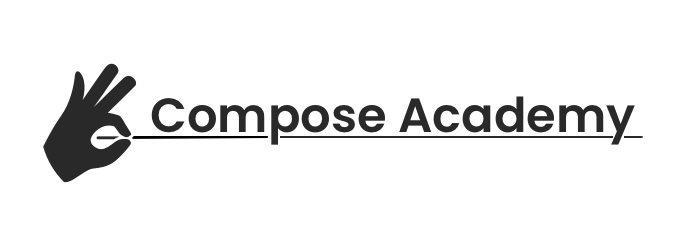

Compose Academy is a free resource that provides snippets and practical samples on how to use Jetpack Compose for the Android platform.

## Still work in progress 🚧

Whilst the site is live, the current catalog is minimal - enough to get started in playing with compose. I will be adding new things quite often

## Something missing? 🕵️‍♂️ 🕵️‍♀️

If there is something missing you'd like documented, please feel free to add an issue in this repo.

## Support the project 🙇‍♂️ 🙇‍♀️

If you are able to [sponsor this project](https://github.com/sponsors/hitherejoe), all money will be dispersed to different charitable organisations.

If you want to make a one-off contribution, please do so to one of the following and let me know so that I can add you to the supporters section 🙂

- Donate to [Reclaim the Block](https://www.reclaimtheblock.org/home/#about)
- Donate to [Black Visions](https://www.blackvisionsmn.org/)
- Buy something for the dogs at [Raystede](https://www.raystede.org/) from their [Amazon Wishlist](https://www.amazon.co.uk/gp/registry/wishlist/4X1FCQP5NDIE)
- Give a [one-off donation](https://www.seashepherd.org.uk/support-us/donate-monthly.html) to Sea Shepherd
- Buy some merchandise from Sea Shepherd ([UK](https://seashepherduktrading.org/), [US](https://shop.seashepherd.org/))

**Sponsers**

  ♥️ [@AndreaGriffiths11](https://github.com/AndreaGriffiths11) - Monthly donation   
  🐶 [@ataulm](https://github.com/ataulm) - 4 items donated to Raystede  
  🐶 [@hackertronix](https://github.com/hackertronix) - Dog treats for Raystede

## Coming soon - the book and tutorial videos 📰

I'm currently writing a book on jetpack compose, based off of compose academy but the writings will be much more in depth. Once the APIs for compose are stable (and close to final), I will be creating a video course too. The best way to be aware of when these are available is to [sign-up to my newsletter](https://mailchi.mp/648900712412/signup_exploring_mobile_development).

## Contributions ✍️

I'm not currently accepting contributions to this repository. My writings for a lot of the API are already work-in-progress, but in future I will be considering opening this up for help!
